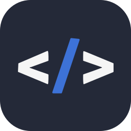

# I'm Aaron

3 years of building backend systems.  
Probably hanging out in a CLI app

---

### Tech Stack

**Languages**  
 

**Backend**  
  

**Tools**  
   

**Libraries**  
 

**Infrastructure**  
   

---

### Why This Stack?

**Go + HTMX**  
I'm a fan of hypermedia-driven architectures. [HATEOAS](https://htmx.org/essays/hateoas/)
(from Roy Fielding's REST dissertation) describes how the server should drive
application state through hypermedia—not through JSON endpoints with rigid client
logic. HTMX lets me build this way: the server sends HTML with the available actions,
and the browser does what it was designed to do. (Also not a huge fan of JS)

**Server as Source of Truth**  
I prefer keeping logic and state on the server. When the server owns the truth
and the frontend just renders it, complexity stays in one place and bugs have
fewer places to exist. [JSON APIs aren't RESTful](https://roy.gbiv.com/untangled/2008/rest-apis-must-be-hypertext-driven)—they're
RPC with extra steps.

**VPS Over Cloud Abstractions**  
I lean toward Hetzner and self-hosted tools like Dokploy. I like understanding
my infrastructure stack and having direct control over where things run. Cloud
platforms are powerful, but I prefer the transparency and cost model of a VPS.

**CLI-First**  
Most of my workflow happens in the terminal. I prefer keeping my hands on the keyboard than reaching for my mouse.

### Connect with me

[Email](mailto:caper2711@hotmail.com)

  

